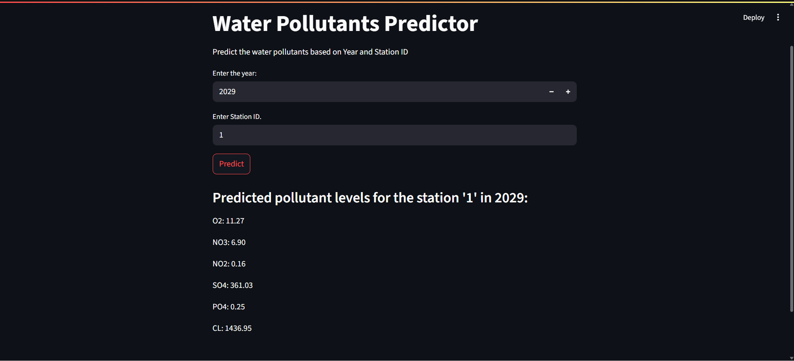

# 💧 Water Quality Prediction using Random Forest Regressor

This project aims to predict water quality indicators using a machine learning model. It uses the Random Forest Regressor algorithm to model the relationship between various chemical parameters in water and their impact on overall quality.

## 🎯 Objective

To train a regression model that can accurately predict specific water quality parameters, aiding environmental monitoring and decision-making.

## 🧠 Machine Learning Workflow

1. **Data Loading & Preprocessing**
   - Reading the dataset from CSV.
   - Handling missing values.
   - Feature scaling or normalization.
   - Splitting data into training and testing sets.

2. **Model Implementation**
   - Used **Random Forest Regressor** from `sklearn.ensemble`.
   - Trained the model on training data.
   - Made predictions on test data.

3. **Model Evaluation**
   - Metrics used:
     - **R² Score (Coefficient of Determination)**
     - **Mean Squared Error (MSE)**
    
  ## 🛠️ Tools & Libraries

- Python
- Pandas
- NumPy
- Scikit-learn
- Jupyter Notebook
- Joblib
- Streamlit
- Pickle

## **💻 Demo**

